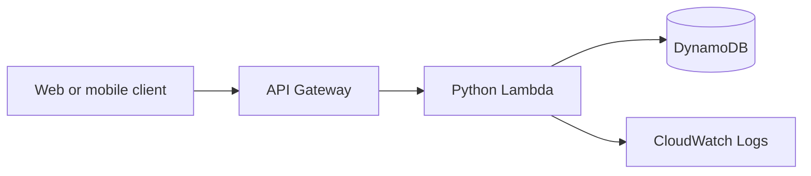

# AWS Serverless Expense Tracker

A production-style REST API for recording and summarizing personal expenses. The project uses AWS SAM to define an API Gateway HTTP API, Python Lambda functions and a DynamoDB table with least-privilege permissions.

## Why this project

This repository demonstrates the cloud, serverless and operational concepts covered in **AWS Fundamentals: Cloud, Serverless and Operations — Commit Academy (September 2026)**.

## Features

- Create and list expenses
- Validate amounts, categories and ISO dates
- Filter expenses by month and category
- Calculate monthly totals grouped by category
- Store data in DynamoDB
- Deploy reproducibly with AWS SAM
- Structured JSON logs and environment-based configuration
- Unit tests that run without an AWS account

## Architecture



## API

| Method | Route | Purpose |
|---|---|---|
| `POST` | `/expenses` | Create an expense |
| `GET` | `/expenses` | List expenses; accepts `month` and `category` |
| `GET` | `/summary/{month}` | Return totals for `YYYY-MM` |
| `DELETE` | `/expenses/{id}` | Delete an expense |

Example request:

```json
{
  "description": "AWS course",
  "amount": 29.99,
  "category": "education",
  "date": "2026-09-18"
}
```

## Run tests

```bash
python -m unittest discover -s tests -v
```

## Deploy

Requirements: AWS CLI, AWS SAM CLI and configured AWS credentials.

```bash
sam build
sam deploy --guided
```

The stack uses on-demand DynamoDB billing and only grants the Lambda function access to its own table.

## Skills demonstrated

AWS Lambda, API Gateway, DynamoDB, CloudFormation/SAM, IAM, Python, REST APIs, validation, automated testing and cloud operations.

## Author

**Herbert Stuardo Pacheco** — [GitHub](https://github.com/StuardoP) · [LinkedIn](https://linkedin.com/in/stuardopacheco)

